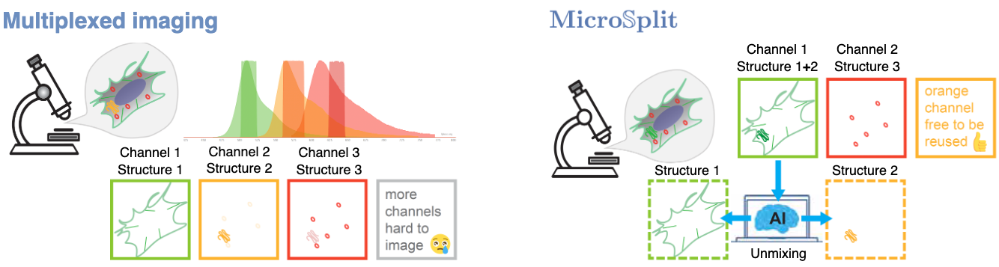
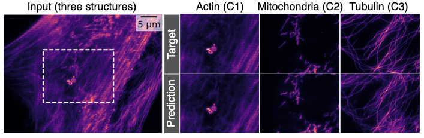
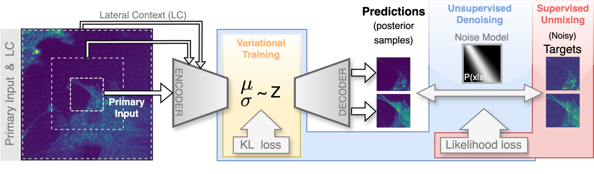

# MicroSplit


[](https://careamics.github.io)
[](https://github.com/CAREamics/MicroSplit-reproducibility/blob/main/LICENSE)
[](https://forum.image.sc/)


## What is MicroSplit

MicroSplit is a deep learning-based computational multiplexing technique that enhances
the imaging of multiple cellular structures within a single fluorescent channel, 
allowing to image more cellular structures, image them faster, and at reduced overall light exposure.

<p>
    
</p>

<p>
    
</p>

MicroSplit is based on a hierarchical variational auto-encoder (LVAE) using lateral context.

<p>
    
</p>

MicroSplit is implemented in the [CAREamics library](https://careamics.github.io), and
this repository contains example notebooks and utilities for reproducing the results
of the MicroSplit paper.


## How to use this repository


> [!IMPORTANT]  
> A GPU is necessary for training the models from scratch. For users interested in testing the examples from the paper, our 
notebooks allow loading pre-trained models and running the inference even without GPU access.


### Set up a Python environment

In order to run the examples, you will need to install PyTorch, CAREamics and the utilities in this repository.

1. Create a new environment with the package manager of your choice, we recommand [mamba](https://mamba.readthedocs.io/en/latest/installation/micromamba-installation.html), but you can also use [conda](https://docs.anaconda.com/miniconda/) (in which case, substitute `mamba` for `conda` in the following bash commands).
    ```bash
    mamba create -n microsplit python=3.9
    mamba activate microsplit
    ```
> [!TIP]  
> If you are on a mac, and wish to make use of Mac silicon GPU (using M1, M2 and M3 chips), create the environment using the following commands:
>    ```bash
>    CONDA_SUBDIR=osx-arm64 conda create -n microsplit python=3.9
>    conda activate microsplit
>    conda config --env --set subdir osx-arm64
>    ```

2. :warning: Install PyTorch following the instructions on the [official website](https://pytorch.org/get-started/locally/).

3. You can test that you have GPU access by running the following command:
    ```bash
    python -c "import torch; print([torch.cuda.get_device_properties(i) for i in range(torch.cuda.device_count())])"
    ```
    To confirm that mac silicon is available do:
    ```bash
    python -c "import torch; import platform; print(platform.processor() in ('arm', 'arm64') and torch.backends.mps.is_available())"
    ```

4. Install MicroSplit utilities from this repository by cloning and navigating into it, then by installing all the necessary packages using `pip`.

    ```bash
    git clone https://github.com/CAREamics/MicroSplit-reproducibility.git
    cd MicroSplit-reproducibility
    pip install .
    ```

> [!TIP]  
> If you are on a Windows machine and have trouble running unix-like commands, check out [Git for Windows](https://gitforwindows.org/). This tool installs Git Bash, a terminal that you can use to run the commands above.


### Clone the repository to access the examples

5. You can now open the notebooks in `jupyter` by running the following command and navigating to the example folder:

    ```bash
    jupyter notebook
    ```

> [!NOTE]  
> The Jupyter notebooks in each example are numbered by their order in the MicroSplit pipeline:
> - 00: Create the noise models for the dataset
> - 01: Train the MicroSplit model
> - 02: Apply MicroSplit to data
> - 03: Calibrate the MicroSplit errors
>
> The notebooks are designed to be run in order, but we designed them so that each notebook, except the calibration, has entry points using pre-trained models.

## Troubleshooting

A list of problems that might be encountered and suggestions on how to solve them.

1. **Problem:** An error saying that your NVIDIA Drivers are too old.

   **Solution:** Try downgrading your PyTorch version, for example:
   ```bash
   pip3 install torch==2.2 torchvision torchaudio --index-url https://download.pytorch.org/whl/cu118
   ```

2. **Problem:** Test for Mac silicon GPU above returns False.
   
   **Solution:** Make sure you install PyTorch with pip, installing it with conda might not work. Make sure you installed the macOS-arm64 release of Anaconda or Mamba.

## Systems tested

The notebooks were tested on multiple systems including Linux, Mac and Windows; more detailed system specifications are as follows:

#### System 1
- **OS Version:** Red Hat Enterprise Linux 8.10
- **GPU:** NVIDIA A40-16Q, 16GB
- **CudaToolKit Version:** 12.4

#### System 2
- **OS Version:** macOS 14.1
- **GPU:** Apple M3 GPU, 16GB

#### System 3
- **OS Version:** Windows 10 Enterprise
- **GPU:** Nvidia RTX A3000 Laptop, 6GB
- **CudaToolKit Version:** 12.3

## Useful links

- [CAREamics documentation](https://careamics.github.io)
- (soon) [MicroSplit algorithm summary]()
- (soon) [Noise models summary]()


## Cite MicroSplit

<!--- Add citation --->

(soon)

## Links to all datasets used in the manuscript
- [HT-H24](https://download.fht.org/jug/msplit/ht_h24/data/ht_h24.zip)
- [HT-P32A](https://download.fht.org/jug/msplit/ht_p23a/data/ht_p23a.zip)
- [HT-P23B](https://download.fht.org/jug/msplit/ht_p23b/data/ht_p23b.zip)
- [Pavia-P24](https://download.fht.org/jug/msplit/pavia_p24/data/pavia_p24.zip)
- [HT-T24](https://download.fht.org/jug/msplit/ht_t24/data/ht_t24.zip)

- [HT-LIF24 (2ms)](https://download.fht.org/jug/msplit/ht_lif24/data/ht_lif24_2ms.zip)
- [HT-LIF24 (3ms)](https://download.fht.org/jug/msplit/ht_lif24/data/ht_lif24_3ms.zip)
- [HT-LIF24 (5ms)](https://download.fht.org/jug/msplit/ht_lif24/data/ht_lif24_5ms.zip)
- [HT-LIF24 (20ms)](https://download.fht.org/jug/msplit/ht_lif24/data/ht_lif24_20ms.zip)
- [HT-LIF24 (500ms)](https://download.fht.org/jug/msplit/ht_lif24/data/ht_lif24_500ms.zip)
- [Chicago-Sch23](https://download.fht.org/jug/msplit/chicago_sch23/data/chicago_sch23.zip)

## License

This project is licensed under BSD-3-Clause License - see the [LICENSE](LICENSE) for details.


    
